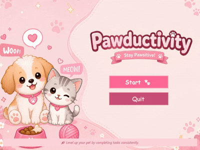
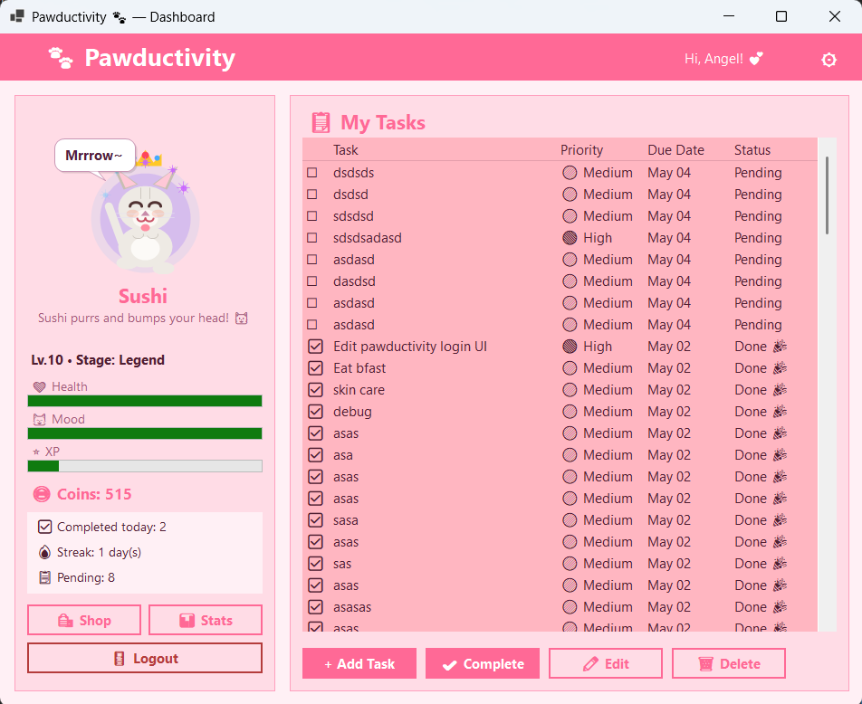
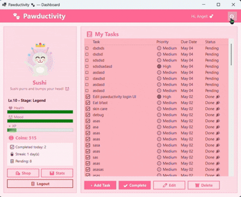
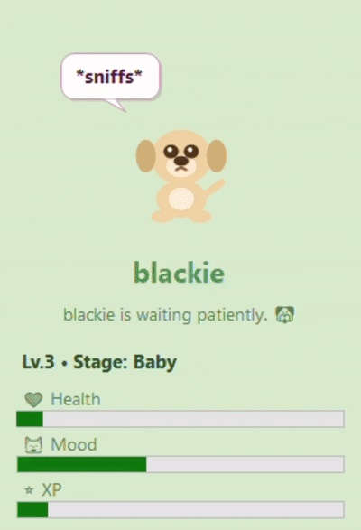
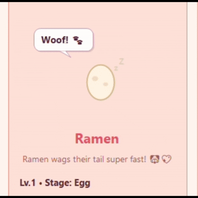
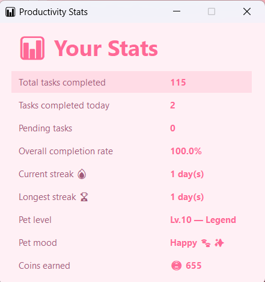
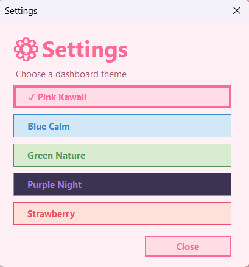

<div align="center">

# 🐾 Pawductivity

**A Digital Pet Productivity System**

*CS 222 · Advanced Object-Oriented Programming · Batangas State University*


> *Stay productive. Keep your pet happy. Don't let your tasks go overdue.*

</div>

---

## 📖 Overview

**Pawductivity** is a gamified productivity desktop app built with **.NET 8 WinForms**. You adopt a virtual pet — a cat 🐱 or a dog 🐶 — and your tasks directly affect its health, mood, level, coins, and evolution.

Complete tasks and your pet gains XP, mood, health, and coins. Let tasks become overdue and your pet loses health and mood. The app features animated pet reactions, floating stat-change animations, coin gain effects, shop item animations, and switchable dashboard themes — so your pet feels alive while you stay on top of your work.

It's a productivity tool with stakes — and a little companion watching your every move.

---

## 🚀 Getting Started

### Prerequisites

| # | Requirement | Details |
|---|---|---|
| 1 | [Visual Studio Community](https://visualstudio.microsoft.com/vs/community/) | Windows only — WinForms requires Windows |
| 2 | **.NET Desktop Development** workload | Select this during Visual Studio installation |
| 3 | **.NET 8 SDK** | Required by `net8.0-windows` |

### Running the App

1. Open **Visual Studio Community**
2. Click **Open a project or solution**
3. Navigate to the `Pawductivity/` folder
4. Open `Pawductivity.slnx`
5. Press **F5** to build and run

> 💡 **Tip:** Use `Ctrl + F5` to run without the debugger for a faster startup.

---

## 📁 Project Structure

```text
Pawductivity/
├── Pawductivity.slnx              ← Solution file
├── Pawductivity.csproj            ← Project file
├── Program.cs                     ← Entry point
├── PawTheme.cs                    ← Theme system, palettes, fonts, button styles
│
├── Assets/                        
│   └── startup_bg.png             ← background for StartupForm
│
├── Animations/
│   ├── PetAnimationState.cs       ← Pet animation state enum
│   └── PetRenderer.cs             ← Cat, dog, speech bubble, and drawing helpers
│
├── Controls/
│   └── PetAnimationControl.cs     ← Animated pet canvas and visual effects
│
├── Models/
│   ├── Pet.cs                     ← Abstract base class: shared pet state and evolution
│   ├── PetTypes.cs                ← CatPet and DogPet behavior
│   ├── AppTheme.cs                ← Theme palette model
│   ├── PetChangeResult.cs         ← Stat-change result used for UI animations
│   ├── TaskItem.cs                ← Task data model and overdue penalty tracking
│   ├── ShopItem.cs                ← Shop item model and default shop list
│   └── SaveData.cs                ← Serializable snapshot models
│
├── Managers/
│   ├── GameManager.cs             ← Core game logic and stat-change calculations
│   └── SaveManager.cs             ← File I/O: save, load, list, delete profiles
│
└── Forms/
    ├── LoginForm.cs               ← Profile selector and new profile creation
    ├── DashboardForm.cs           ← Main screen: task list, stats, and pet control host
    ├── TaskEditForm.cs            ← Add and edit task dialog
    ├── SettingsForm.cs            ← Theme selection screen
    ├── ShopForm.cs                ← Coin shop and purchase flow
    └── StatsForm.cs               ← Productivity analytics
    └── Startupform.cs             ← First screen, title/welcome screen
```

---

## 🖼️ Visual Preview

<div align="center">

### Start Up



### Dashboard



### Theme Switching



### Pet Animation




</div>

---

## 🔄 Gameplay Loop

```text
Login → Add Task → Complete Task → Pet Reacts → Earn Coins → Buy Items
           ↑                                                       |
           └───────────────────── loop ────────────────────────────┘
```

Every task you complete rewards you and your pet. Every overdue task applies a health and mood penalty **once**, then remembers it — so the same task won't drain your pet repeatedly every minute.

Progress is **automatically saved** when the app closes and restored on reopen. Profiles, pet stats, tasks, streaks, coins, selected theme, and overdue penalty state are all persisted.

---

## 🎮 Features

| Feature | Status |
|---|:---:|
| Login with username and pet name | ✅ |
| Multi-profile support | ✅ |
| Choose Cat 🐱 or Dog 🐶 | ✅ |
| Add, edit, delete, and complete tasks | ✅ |
| Task priority and due-date tracking | ✅ |
| Complete tasks → pet gains XP, mood, health, and coins | ✅ |
| Overdue tasks → pet loses health and mood once per overdue task | ✅ |
| Pet levels up and evolves | ✅ |
| Animated cat and dog pet drawings | ✅ |
| Speech bubbles based on mood | ✅ |
| Task completion animations | ✅ |
| XP, mood, health, and coin floating animations | ✅ |
| Shop item purchase animations | ✅ |
| Coin-based shop system | ✅ |
| Daily streak tracking | ✅ |
| Productivity stats and analytics screen | ✅ |
| Settings form with switchable themes | ✅ |
| Theme persistence across sessions | ✅ |
| Data persistence across sessions | ✅ |
| Atomic save writes | ✅ |

---

## 🌱 Pet Evolution

<div align="center">
  
  
</div>

Your pet evolves through five stages as you level up. Each level costs `current_level × 50 XP`, so progression gets harder over time.

| Stage | Level | Cat 🐱 | Dog 🐶 |
|---|---|---|---|
| 🥚 **Egg** | 1 | `🥚` | `🥚` |
| 🐱 **Baby** | 2–3 | `🐱` | `🐶` |
| 🐈 **Junior** | 4–6 | `🐈‍⬛` | `🐕` |
| 🐈 **Adult** | 7–9 | `🐈` | `🦮` |
| ✨ **Legend** | 10+ | `✨🐈‍⬛✨` | `✨🐕‍🦺✨` |

**How XP works:** Cats earn more XP per task but lose mood faster when one is missed. Dogs earn slightly less XP but are more forgiving on mood — though they take more health damage.

| Pet | High priority | Medium priority | Low priority |
|---|---:|---:|---:|
| 🐱 Cat XP | +30 | +20 | +10 |
| 🐶 Dog XP | +25 | +15 | +8 |

> Each pet starts with **Health 80 · Mood 70 · Level 1 · 0 coins**. Health and mood are clamped between 0–100, and coins can never go below 0.

---

## 😺 Mood System

Your pet's mood is a 0–100 value that maps to one of four states:

| Mood | State | Emoji | Effect |
|---|---|---|---|
| 70–100 | Happy | `🐾✨` | Positive greetings and happy animation |
| 40–69 | Neutral | `🐾` | Calm, waiting behavior |
| 20–39 | Sad | `😿` / `🥺` | Sad expression and animation |
| 0–19 | Sick | `🤒` | Urgent — complete tasks or visit the shop |

### Task Effects

| Event | Cat 🐱 | Dog 🐶 |
|---|---|---|
| Complete high task | +30 XP, +15 Mood, +5 Health, +15 Coins | +25 XP, +20 Mood, +8 Health, +12 Coins |
| Complete medium task | +20 XP, +15 Mood, +5 Health, +10 Coins | +15 XP, +20 Mood, +8 Health, +7 Coins |
| Complete low task | +10 XP, +15 Mood, +5 Health, +5 Coins | +8 XP, +20 Mood, +8 Health, +4 Coins |
| Miss overdue task | −20 Mood, −8 Health | −12 Mood, −10 Health |

Overdue penalties are applied only once per task via `TaskItem.OverduePenaltyApplied`.

---

## 🐾 Pet Animations

The animation system is fully decoupled from the dashboard UI. `DashboardForm` hosts `PetAnimationControl`, while all drawing logic lives in `Animations/PetRenderer.cs`.

| Event | Animation |
|---|---|
| Idle | Gentle bounce, blinking, mood-based expression |
| Speech bubble | Random cat/dog messages based on mood |
| Task completed | XP, mood, and coin floating text |
| Task overdue | Health and mood loss floating text |
| Coin reward | Coin gain animation after task completion |
| Shop purchase | Item-specific visual effect and stat gain animation |

---

## 📊 Stats & Analytics

<div align="center">



</div>

The **Stats screen** (`StatsForm`) gives you a snapshot of your productivity over time. Access it from the dashboard to review your progress and see how well you've been keeping your pet happy.

Tracked metrics include:

| Metric | Description |
|---|---|
| Tasks completed | Total number of tasks finished |
| Tasks missed | Total overdue tasks that triggered a penalty |
| Current streak | Consecutive days with at least one task completed |
| Longest streak | Your all-time best streak |
| Coins earned | Total coins accumulated from task completions |
| Pet level | Current evolution stage and level progress |

Use the stats screen to spot patterns — if your pet keeps getting sick, it's a sign your task completion rate needs work. 🐾

---

## 🛍️ Shop

<div align="center">


</div>

Coins are earned by completing tasks (`XP gained ÷ 2`). Spend them to restore your pet's health and mood.

| Item | Cost | Health | Mood | Animation |
|---|:---:|:---:|:---:|---|
| 🎀 Pink Ribbon | 10 | — | +15 | Ribbon sparkle |
| 🍪 Star Cookie | 15 | +20 | +10 | Eating animation |
| 🍓 Strawberry Milk | 20 | +30 | — | Sip animation |
| 🌸 Flower Crown | 25 | — | +30 | Bloom effect |
| 🛏️ Cozy Blanket | 30 | +25 | +20 | Cozy effect |
| 🌈 Rainbow Toy | 40 | — | +40 | Play animation |

---

## ⚙️ Themes

<div align="center">



</div>

Open settings via the `⚙` button in the top bar to switch themes instantly. Each profile saves its own theme selection.

| Theme | Style |
|---|---|
| Pink Kawaii | Original soft pink theme |
| Blue Calm | Light blue productivity palette |
| Green Nature | Fresh green palette |
| Purple Night | Dark purple theme |
| Strawberry | Warm red-pink palette |

Theme palettes live in `PawTheme.cs`. `PawTheme.SetTheme(...)` updates the active palette, and forms read colors from static properties:

```csharp
public static Color Background => _activeTheme.Background;
public static Color Primary    => _activeTheme.Primary;
public static Color Surface    => _activeTheme.Surface;
// ...

```

---

## 🎓 OOP Principles

Pawductivity demonstrates all four core OOP concepts deliberately and practically.

### 🔒 Encapsulation — `Pet.cs`

Core stats are protected with private backing fields. Public properties enforce rules on every write:

```csharp
public int Health
{
    get => _health;
    set => _health = Math.Clamp(value, 0, 100);  // always within bounds
}

public int XP
{
    get => _xp;
    set { _xp = value; CheckLevelUp(); }          // auto level-up check
}

public int Coins
{
    get => _coins;
    set => _coins = Math.Max(0, value);            // never negative
}
```

### 🧬 Inheritance — `Pet.cs` → `CatPet` / `DogPet`

`Pet` is an abstract base class that owns shared data, mood calculation, level-up logic, evolution stages, and save/restore logic. `CatPet` and `DogPet` inherit everything and add their own behavior.

```csharp
public abstract class Pet { ... }
public class CatPet : Pet { ... }
public class DogPet : Pet { ... }
```

### 🔀 Polymorphism — `PetTypes.cs`

Abstract methods ensure each subclass reacts in its own way. `GameManager` calls the same method regardless of pet type:

```csharp
public abstract void ReactToTaskCompleted(TaskItem task);
public abstract void ReactToTaskMissed();
public abstract string GetGreeting();
```

### 🏗️ Abstraction — `GameManager.cs`, `SaveManager.cs`, `PetAnimationControl.cs`

Forms call simple, expressive methods without knowing the internal rules:

```csharp
var change   = _gm.CompleteTask(task.Id);
var overdue  = _gm.ApplyOverduePenalties();
var purchase = _gm.BuyItem(item);
```

Each method returns a `PetChangeResult` that tells the UI exactly what changed — keeping game logic out of the forms entirely. Save/load is similarly hidden behind `SaveManager.Save(_gm)` and `SaveManager.Restore(data)`.

---

<div align="center">

## 👥 Team

**Team LAVA** · CS-2202 · Batangas State University

*Made with 💖 for CS 222 — Advanced Object-Oriented Programming*

</div>
